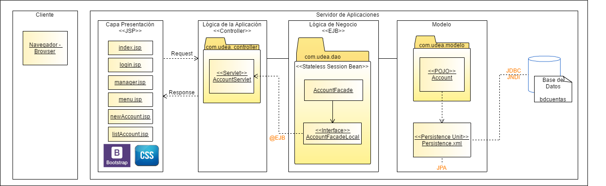
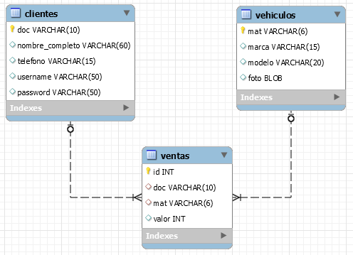
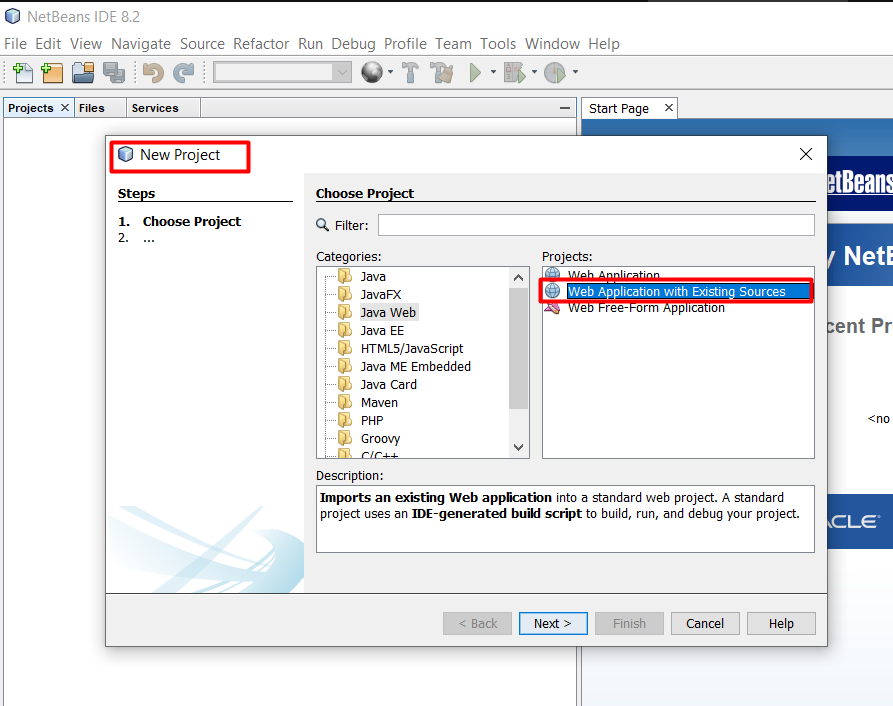
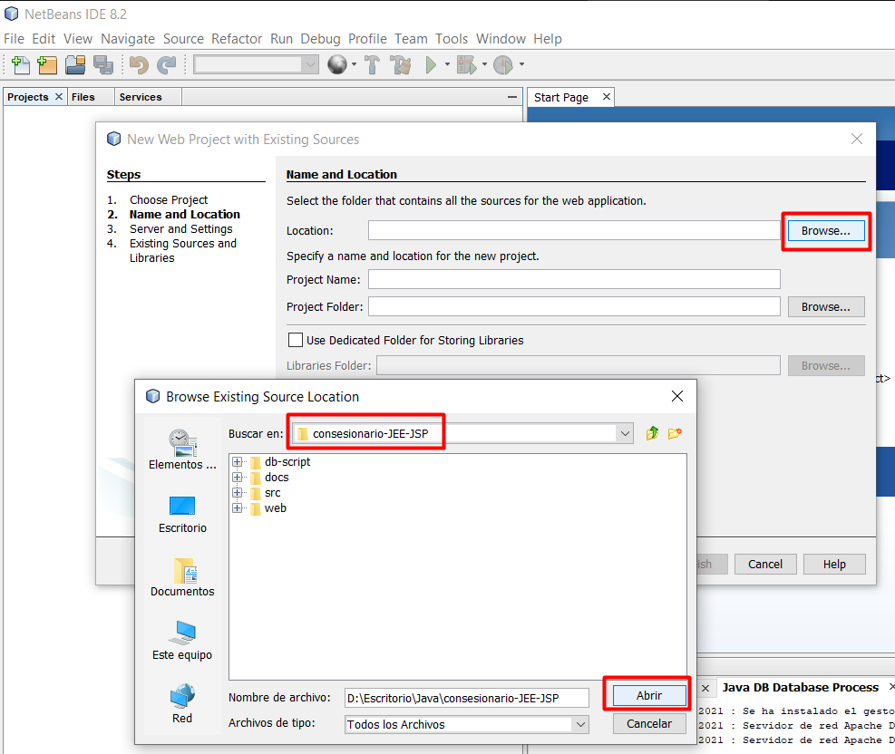
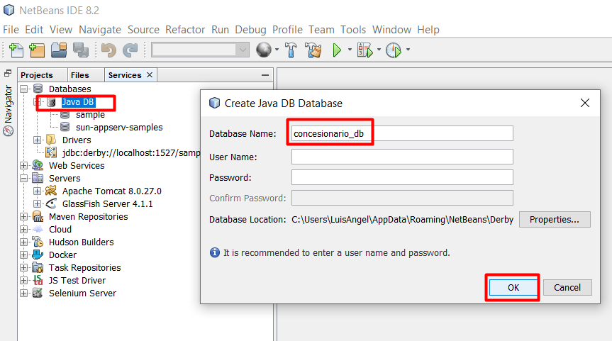
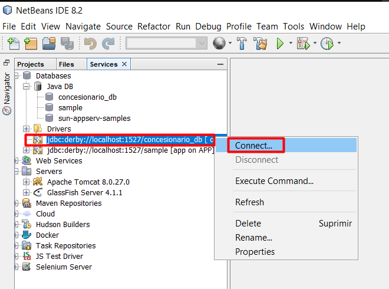
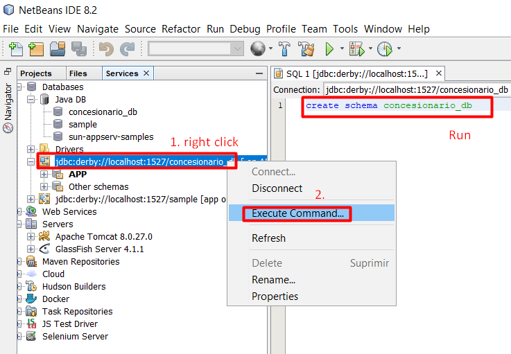
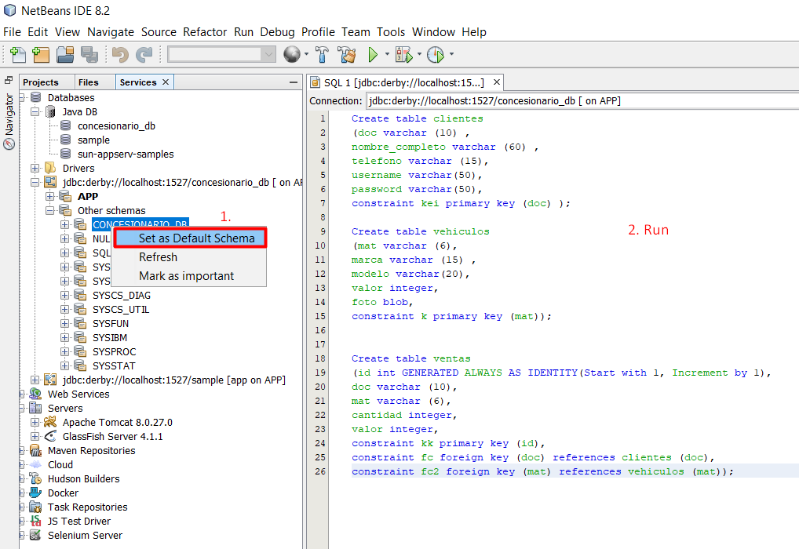
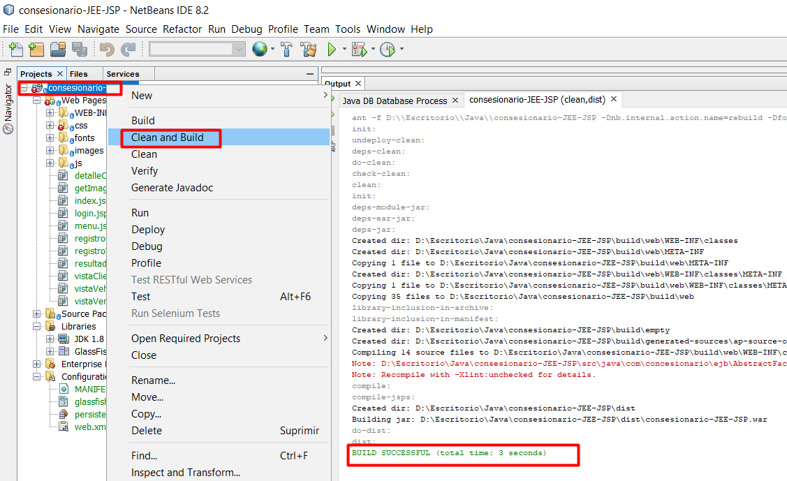
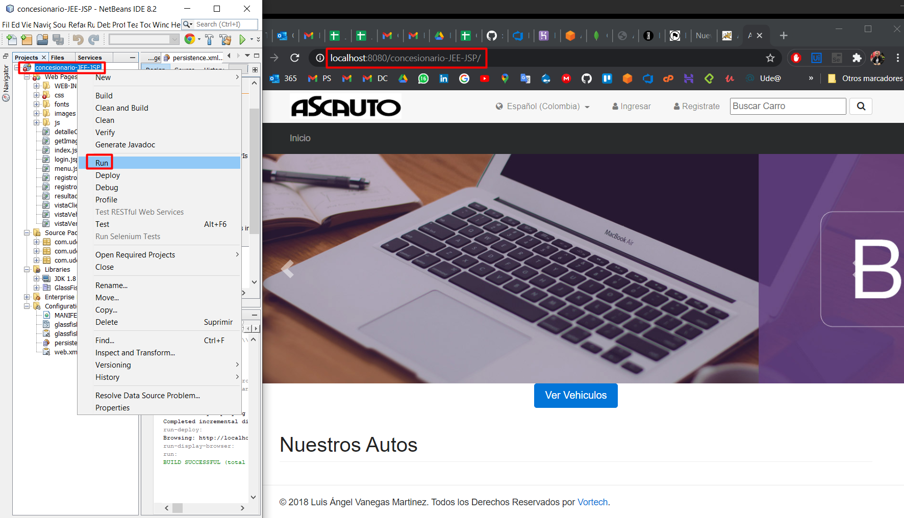

# Concesionario

## Architecture 

## Model

## Initial Configuration [Local]

1. Import project in Netbeans  
    

    Select the folder with source code
    
     

    > Select Glassfish Server

2. Create Data Base
    use the script `db-script/concesionario_db-ScriptDerby.sql` and create `concesionario_db` in `Java DB`

    

    Connect the new Database

    

    Create the new Schema

    

    Set as default and execute the script for create tables

    

## Executing 

1. Clean and Build 

    

2. Run

    
    
## Possible Problems

