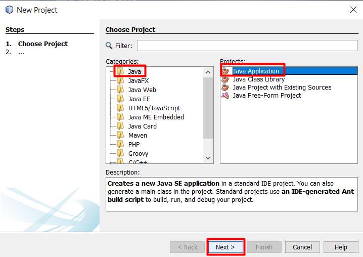
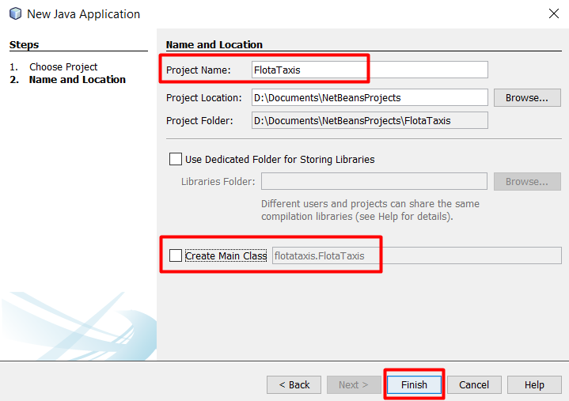
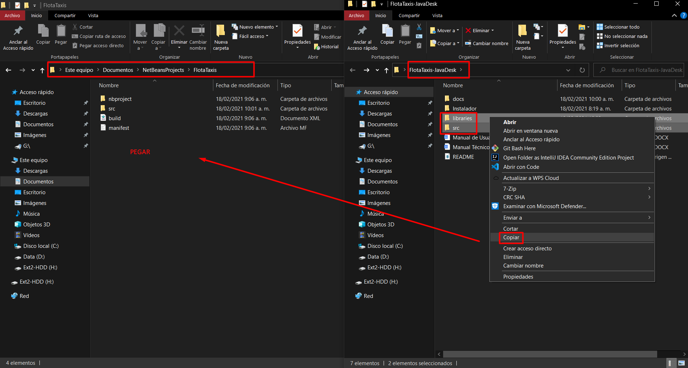
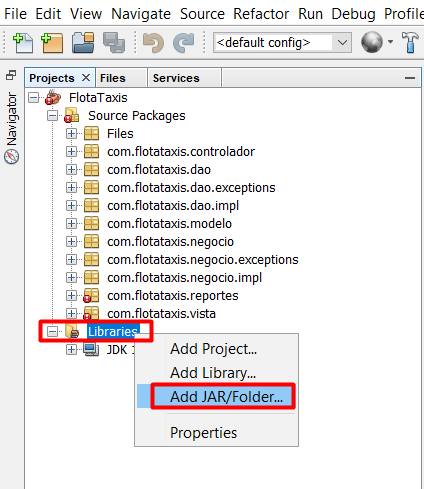
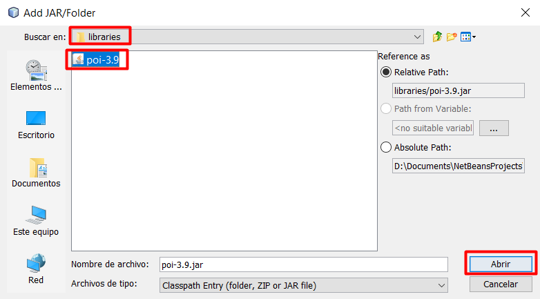
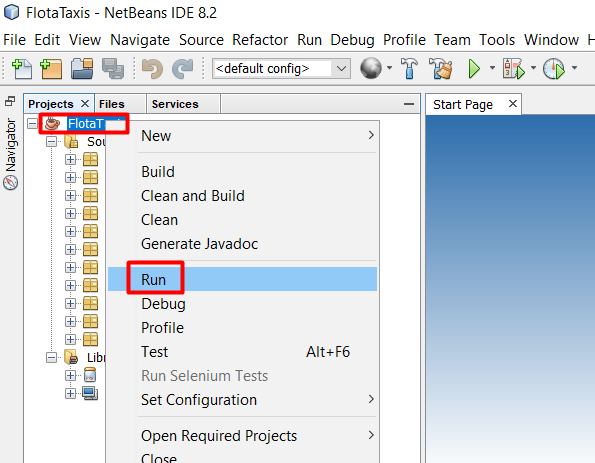

# FlotaTaxis-Java-Desk

Java - Desk - NCapas - DAO - DTO - POO - TXT - Desktop Application

The data is saved in txt files and not in database

---

 

## Initial Configuration [Local]

1. Import new project

    

2. Enter the name and location of new project

    

3. Replace `/src` of the new project with `/src` of repo and copy and paste `/libraries` in the path of new project

    

4. Add libraries 

    

    Select the folder `library` and library `poi-3.9`

    

---

 

## Executing

NOTE: The files TXT of database, are stored in `C:\Users\Public\Documents`

---

 

## Possible Solutions Problems 

- In case of error, click in `file - Clean and Build`