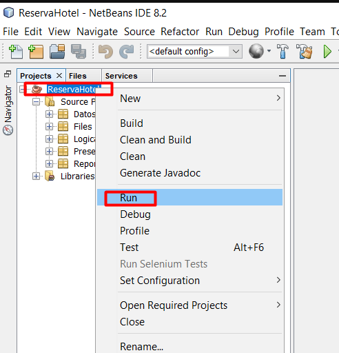

# ReservaHotel-Java-Desk

Java - MVC - POO - MySQL - Desktop Application

 

## DevTools

- iReport 5.6.0
- jre-8u151-windows-i586
- mysql-connector-java-5.1.45

---

 

## Initial Configuration [Local]

1. Create database in MySQL
    use the script `university_db.sql` and create `university_db` in `MySQL`

2. Import new project

    

3. Enter the name and location of new project

    

4. Replace `/src` of the new project with `/src` of repo and copy and paste `/libraries` in the path of new project

    

5. Add libraries 

    

    Select the folder `library` and all libraries

    

---

 

## Executing 

1. Run

    
    > Select `frmusuariologin`

2. Login in the System

    The password and user is: `luis`

---

 

## Possible Solutions Problems

- In case of error, click in `file - Clean and Build`

