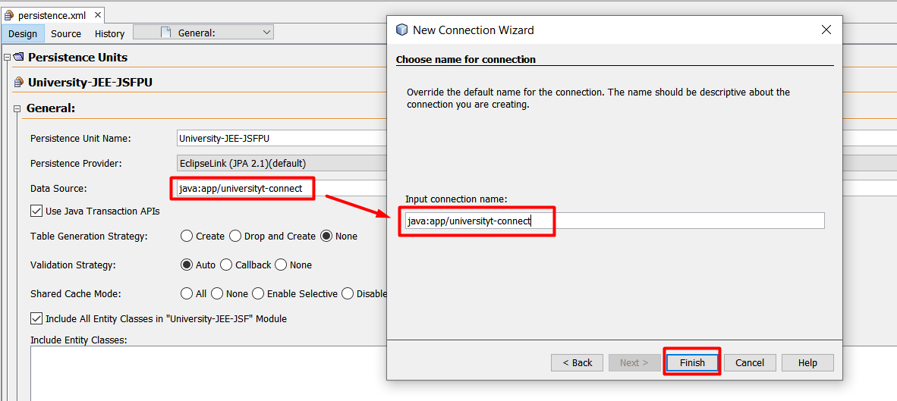
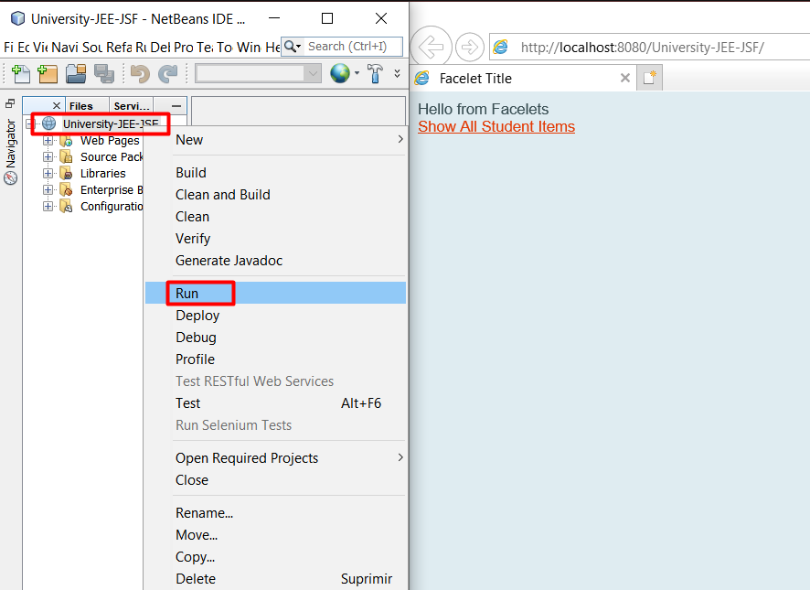

# University

JSF - JEE - JPA - EJB - Web Application

 

## Initial Configuration [Local]

1. Create database in MySQL
    use the script `university_db.sql` and create `university_db` in `MySQL`

    Connect database MySQL in Netbeans

    

    

    

 

2. Import project in Netbeans  

    

    Select the folder with source code
    
     

    > Select Glassfish Server

 

3. Create new conection for MySQL and the Persistence Unit 

    New Connection

    

    Select Connector

    

    Test Connection

    

    Connection Name
    > IMPORTAN: the name connection is equal to data source connection of persistence

    

 

## Executing 

1. Run

    

 

## Possible Solutions Problems

